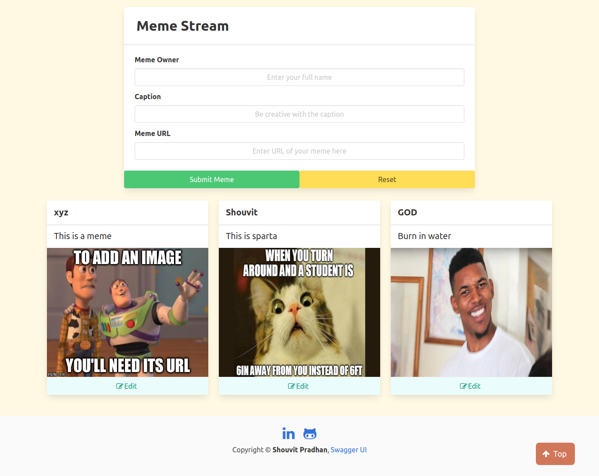
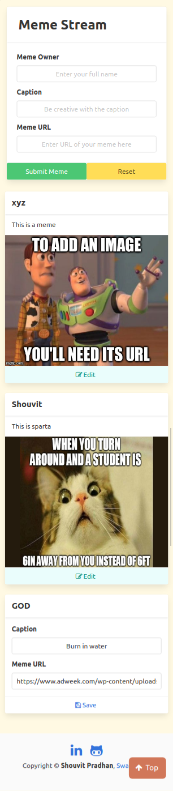
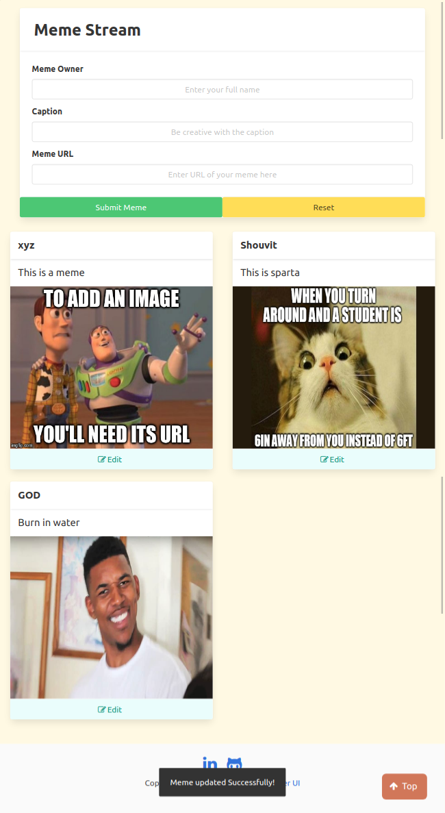

# meme-stream-frontend

The front-end repo for the meme-stream project, a place for memers to share and appreciate memes together.

    
<b>Built using</b>

    <ul>
        <li>HTML5/CSS3</li>
        <li>JavaScript</li>
        <li>BULMA CSS</li>
        <li>FontAwesome</li>
    </ul>

    
<b>Deployed using</b>

    <ul>
        <li>Netlify</li>
    </ul>

    
<b>Frontend Link</b>

    <ul>
        <li>
            <a href="https://xmeme-shaw8wit.netlify.app/">XMEME</a>
        </li>
    </ul>

    
<b>Screenshots</b>

    <ul>
        <li>
            

                
Desktop

                
            

        </li>
        <li>
            

                
Mobile

                
            

        </li>
        <li>
            

                
Tablet

                
            

        </li>
    </ul>

